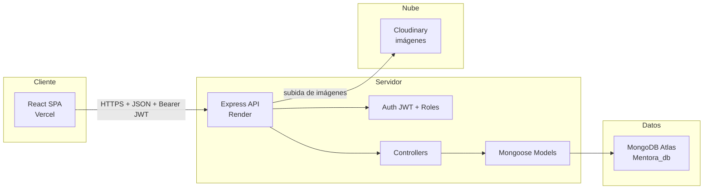
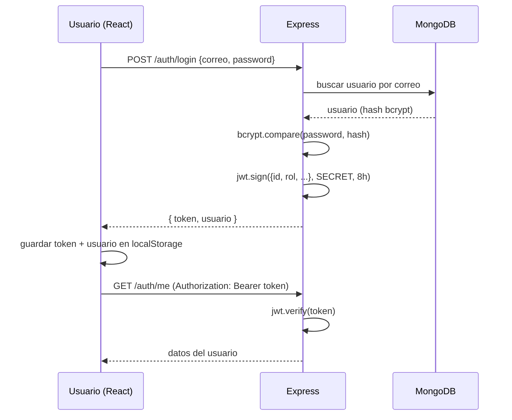
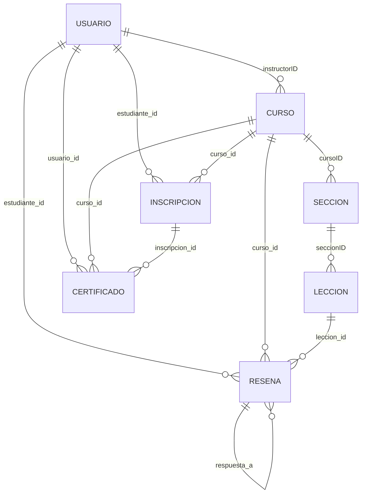

# MENTORA — Plataforma de Cursos Online (Stack MERN)

**Informe de Proyecto Escolar**

**[Tu Nombre]** · **[Nombre del Colegio]** · **[Materia] · [Fecha]**

---

## Tabla de contenidos

1. Introducción
2. Requerimientos
3. Diagramas
4. Arquitectura
5. Diseño de Base de Datos
6. API REST
7. Implementación
8. Pruebas
9. Conclusiones
10. Referencias

---

## 1. Introducción

**Mentora** es una plataforma web de cursos en línea construida con el stack **MERN** (MongoDB, Express, React y Node.js). Permite que **instructores** creen y publiquen cursos (organizados en secciones y lecciones en video), y que **estudiantes** se inscriban, lleven un control de su progreso, dejen reseñas y obtengan un certificado al completar el curso.

El proyecto resuelve el problema de **organizar contenido educativo en un solo lugar** con roles diferenciados:

- **Instructor**: crea, edita, publica y elimina sus propios cursos; responde comentarios; consulta su panel de estadísticas.
- **Estudiante**: explora cursos, se inscribe, avanza en las lecciones, deja reseñas y descarga su certificado.

El sistema incluye autenticación con **JWT**, contraseñas cifradas con **bcrypt**, control de acceso por **roles** y por **propietario del recurso**, subida de imágenes a **Cloudinary** y despliegue en **Render** (backend) y **Vercel** (frontend).

### Objetivos

- Construir una API REST completa con Node.js y Express.
- Modelar los datos con MongoDB (Mongoose) y sus relaciones.
- Implementar autenticación segura (bcrypt + JWT) y control de roles.
- Crear un frontend SPA con React que consuma la API.
- Desplegar la aplicación en servicios en la nube (Render y Vercel).

---

## 2. Requerimientos

### 2.1 Requerimientos funcionales

| ID | Requerimiento |
|---|---|
| RF1 | Registro de usuarios (solo correos Gmail) y login con contraseña. |
| RF2 | Emisión de token JWT al iniciar sesión (expira en 8 horas). |
| RF3 | Consultar y editar el perfil del usuario autenticado. |
| RF4 | CRUD de cursos (solo el instructor dueño). |
| RF5 | Publicar/ocultar un curso (visibilidad). |
| RF6 | CRUD de secciones y lecciones (solo instructor dueño). |
| RF7 | Listar cursos públicos (publicados) y buscar por título/categoría. |
| RF8 | Inscripción del estudiante a un curso y pago simulado. |
| RF9 | Marcar lecciones como completadas y calcular el porcentaje de avance. |
| RF10 | Crear, actualizar, eliminar y responder reseñas/comentarios. |
| RF11 | Emitir certificado al estudiante al completar un curso. |
| RF12 | Dashboard con estadísticas para instructor y estudiante. |
| RF13 | Subir foto de perfil y portada de curso (Cloudinary, máx. 2 MB). |

### 2.2 Requerimientos no funcionales

| ID | Requerimiento |
|---|---|
| RNF1 | Backend en Node.js con Express 4 y Mongoose 6 (CommonJS). |
| RNF2 | Frontend SPA en React 19 con Vite (ESM). |
| RNF3 | Base de datos MongoDB en la nube (MongoDB Atlas). |
| RNF4 | Contraseñas cifradas con bcrypt; tokens firmados con JWT. |
| RNF5 | CORS configurado para permitir peticiones del frontend. |
| RNF6 | Imágenes: solo JPG/PNG/WEBP/GIF, máximo 2 MB, alojadas en Cloudinary. |
| RNF7 | Despliegue del backend en Render y del frontend en Vercel. |
| RNF8 | Interfaz en español, responsive, con componentes reutilizables. |

---

## 3. Diagramas

### 3.1 Arquitectura general



Versión ASCII (para copiar en Word):

```
        React SPA (Vercel)
              │  HTTPS + JSON + Authorization: Bearer <JWT>
              ▼
        Express API (Render)
        ┌───────────────┐
        │ Middlewares   │  CORS, json, auth, roles, uploads
        ├───────────────┤
        │ Controllers   │  lógica de negocio
        ├───────────────┤
        │ Models        │  Mongoose (esquemas)
        └───────┬───────┘
                ▼
        MongoDB Atlas (Mentora_db)      Cloudinary (imágenes)
```

### 3.2 Flujo de autenticación



### 3.3 Diagrama entidad-relación (colecciones)



Versión ASCII:

```
  Usuario 1 ────< N Curso (instructorID)
  Curso   1 ────< N Seccion (cursoID)
  Seccion 1 ────< N Leccion (seccionID)
  Usuario 1 ────< N Inscripcion (estudiante_id)
  Curso   1 ────< N Inscripcion (curso_id)
  Usuario 1 ────< N Resena (estudiante_id)
  Curso   1 ────< N Resena (curso_id)
  Leccion 1 ────< N Resena (leccion_id)
  Resena  1 ────< N Resena (respuesta_a, autoreferencia)
  Usuario 1 ────< N Certificado (usuario_id)
  Curso   1 ────< N Certificado (curso_id)
  Inscripcion 1 ────< N Certificado (inscripcion_id)
```

---

## 4. Arquitectura

### 4.1 Backend (Express + Mongoose)

Organización por capas, siguiendo el flujo `router → controllers → models`:

```
Backend/
├── app.js               # Configuración (CORS, JSON, estáticos) y montaje de routers
├── index.js             # Conexión a MongoDB y arranque del servidor
├── constants.js         # Valores por defecto (BD, JWT, Cloudinary)
├── seed.js              # Poblado de la BD con datos de prueba
├── config/cloudinary.js # Configuración del SDK de Cloudinary
├── middlewares/
│   ├── authMiddleware.js    # Valida el JWT
│   ├── roleMiddleware.js    # Control de roles
│   └── uploadMiddleware.js  # Multer + Cloudinary (foto, portada)
├── models/              # Esquemas de Mongoose (7 colecciones)
├── controllers/         # Lógica de negocio por recurso
├── router/              # Definición de rutas HTTP (12 routers)
└── scripts/             # Utilidades (fijarPassword, migraciones)
```

### 4.2 Frontend (React + Vite)

Cada funcionalidad vive en `src/pages/<ruta>/` con un **barrel** `index.js`:

```
FrontEnd/src/
├── Api/axios.js         # Cliente HTTP con interceptores
├── App.jsx              # Definición de rutas (React Router)
├── context/AuthContext.jsx  # Sesión global (usuario, login, logout)
├── components/          # Layout, Navbar, Modales, Iconos SVG
└── pages/
    ├── auth/            # Login, Register
    ├── cursos/          # Lista, Preview, Form, Aprendizaje
    ├── dashboard/       # Instructor y Estudiante
    ├── certificados/    # Mis certificados
    ├── landing/         # Página principal
    ├── perfil/          # Edición de perfil
    └── usuarios/        # Perfil público
```

### 4.3 Despliegue

- **Backend**: Render (`https://backend-render-bobx.onrender.com`). Variables de entorno en el panel; MongoDB Atlas y Cloudinary se configuran por variables.
- **Frontend**: Vercel (`https://frontend-vercel-sage.vercel.app`). La variable `VITE_API_URL` apunta a la URL del backend.

---

## 5. Diseño de Base de Datos

Base de datos **MongoDB Atlas** (`Mentora_db`), 7 colecciones.

### 5.1 Usuario

| Campo | Tipo | Notas |
|---|---|---|
| nombre | String | requerido |
| apellido | String | requerido |
| correo | String | requerido, único, lowercase |
| password | String | requerido, mín. 6, cifrada con bcrypt |
| rol | String | enum: `instructor` / `estudiante` |
| biografia | String | — |
| foto | String | URL (Cloudinary) |
| redes_sociales | Subdocumento | facebook, instagram, linkedin, github, whatsapp |
| activo | Boolean | default `true` |

### 5.2 Curso

| Campo | Tipo | Notas |
|---|---|---|
| instructorID | ObjectId → Usuario | requerido; validador: debe ser instructor |
| titulo | String | requerido |
| descripcion | String | — |
| categoria | String | — |
| nivel | String | enum: principiante / intermedio / avanzado |
| precio | Number | mín. 0 |
| imagen | String | URL (Cloudinary) |
| publicado | Boolean | default `false` |
| calificacion_promedio | Number | 0–5 |
| total_inscritos | Number | — |

### 5.3 Seccion y 5.4 Leccion

| Colección | Campo | Tipo | Notas |
|---|---|---|---|
| Seccion | cursoID | ObjectId → Curso | requerido |
| Seccion | titulo | String | requerido |
| Seccion | orden | Number | — |
| Leccion | seccionID | ObjectId → Seccion | requerido |
| Leccion | titulo | String | requerido |
| Leccion | descripcion | String | — |
| Leccion | url | String | video (validación en el controlador) |
| Leccion | duracion | Number | minutos |
| Leccion | orden | Number | — |

### 5.5 Reseña (archivo del modelo: `Reseñas.js`)

| Campo | Tipo | Notas |
|---|---|---|
| estudiante_id | ObjectId → Usuario | requerido |
| curso_id | ObjectId → Curso | requerido |
| leccion_id | ObjectId → Leccion | opcional (reseña por lección) |
| respuesta_a | ObjectId → Reseñas | autoreferencia para hilos/respuestas |
| calificacion | Number | 1–5 (solo reseñas, no respuestas) |
| comentario | String | — |

### 5.6 Inscripcion

| Campo | Tipo | Notas |
|---|---|---|
| estudiante_id | ObjectId → Usuario | requerido |
| curso_id | ObjectId → Curso | requerido |
| progreso | Array de subdocumentos | `{ leccion_id, completada }` embebido |
| porcentaje | Number | 0–100 |
| fecha_inscripcion | Date | — |

### 5.7 Certificado

| Campo | Tipo | Notas |
|---|---|---|
| usuario_id | ObjectId → Usuario | requerido |
| curso_id | ObjectId → Curso | requerido |
| inscripcion_id | ObjectId → Inscripciones | — |
| fecha_finalizacion | Date | — |

**Índice único**: `{ usuario_id, curso_id }` → solo un certificado por usuario y curso.

### 5.8 Relaciones clave

- Un curso **pertenece a** un instructor; las secciones a un curso; las lecciones a una sección.
- Las reseñas e inscripciones **referencian** usuario y curso (y opcionalmente lección).
- Los certificados referencian usuario, curso e inscripción.
- Las relaciones se resuelven con `populate` de Mongoose al consultar.

---

## 6. API REST

Todas las rutas van bajo `/api/v1`. Protección: `auth` = requiere JWT; `instructor`/`estudiante` = además exigen el rol.

| Método | Ruta | Protección | Descripción |
|---|---|---|---|
| POST | `/auth/register` | pública | Registro (solo Gmail) |
| POST | `/auth/login` | pública | Login, devuelve JWT |
| GET | `/auth/me` | auth | Datos del usuario |
| POST | `/auth/refresh` | auth | Renueva el token |
| PUT | `/auth/profile` | auth | Actualiza perfil |
| GET | `/Usuarios` | auth | Lista usuarios |
| POST | `/Usuarios` | auth + instructor | Crea usuario |
| PUT/DELETE | `/Usuarios/:id` | auth (+instructor para DELETE) | Actualiza/elimina |
| GET | `/Usuarios-publico/:id` | pública | Perfil público |
| GET | `/Instructores/:id` | pública | Perfil público de instructor |
| GET | `/Cursos` | pública | Lista cursos publicados |
| POST | `/Cursos` | auth + instructor | Crea curso |
| GET | `/Cursos/categorias` | pública | Categorías |
| GET | `/Cursos/tendencia` | pública | Cursos en tendencia |
| GET | `/Cursos/:id` | pública | Detalle (no publicado solo dueño) |
| PUT/PATCH/DELETE | `/Cursos/:id` | auth + instructor (dueño) | Editar, publicar, eliminar |
| GET | `/Cursos/:id/inscritos` | auth + instructor | Inscritos de un curso |
| GET | `/Cursos/:id/inscritos-detalle` | auth + instructor | Detalle de inscritos |
| POST | `/Secciones` | auth + instructor (dueño) | Crear sección |
| GET | `/Secciones?cursoID=` | pública | Secciones de un curso |
| PUT/DELETE | `/Secciones/:id` | auth + instructor (dueño) | Editar/eliminar |
| POST | `/Lecciones` | auth + instructor (dueño) | Crear lección |
| GET | `/Lecciones?seccionID=` | pública | Lecciones de una sección |
| PUT/DELETE | `/Lecciones/:id` | auth + instructor (dueño) | Editar/eliminar |
| POST | `/Inscripciones` | auth + estudiante | Inscribirse |
| POST | `/Inscripciones/pagar` | auth + estudiante | Pago simulado |
| GET | `/Inscripciones/mis-cursos` | auth | Cursos del estudiante |
| PATCH | `/Inscripciones/:id/lecciones/:leccionId` | auth + estudiante | Completar lección |
| DELETE | `/Inscripciones/:id` | auth + estudiante | Salir del curso |
| POST | `/Resenas` | auth + estudiante/instructor | Crear reseña/respuesta |
| GET | `/Cursos/:id/resenas` | pública | Reseñas de un curso |
| GET | `/Lecciones/:id/resenas` | pública | Reseñas de una lección |
| PUT/DELETE | `/Resenas/:id` | auth + estudiante/instructor | Editar/eliminar |
| POST | `/Certificados` | auth | Emitir certificado |
| GET | `/Certificados/mios` | auth | Mis certificados |
| GET | `/Dashboard/instructor` | auth + instructor | Estadísticas instructor |
| GET | `/Dashboard/estudiante` | auth + estudiante | Estadísticas estudiante |
| POST | `/uploads/profile-photo` | auth | Subir foto de perfil |
| POST | `/uploads/course-cover` | auth + instructor | Subir portada |

Formato de respuesta base: `{ success, message?, ... }` — la clave de payload varía por endpoint.

---

## 7. Implementación

### 7.1 Autenticación con JWT y bcrypt

En el modelo `Usuario`, un hook `pre("save")` cifra la contraseña solo si cambió:

```js
usuarioSchema.pre("save", async function (next) {
  if (this.isModified("password")) {
    const salt = await bcrypt.genSalt(10);
    this.password = await bcrypt.hash(this.password, salt);
  }
  next();
});
```

El método `compararPassword` usa `bcrypt.compare` y **nunca lanza 500** aunque el hash sea inválido (defensa ante cuentas legacy):

```js
usuarioSchema.methods.compararPassword = function (password) {
  try { return bcrypt.compare(password, this.password); }
  catch { return false; }
};
```

Al hacer login/registro se firma un JWT:

```js
jwt.sign({ id, correo, rol, nombre }, JWT_SECRET, { expiresIn: "8h" });
```

El `authMiddleware` lee el encabezado `Authorization: Bearer <token>`, lo verifica con `jwt.verify` y coloca `req.user`. El `roleMiddleware` valida que `req.user.rol` esté en la lista permitida (401 si no hay token, 403 si el rol no coincide). Además, los controladores verifican que el usuario sea el **propietario** del recurso (ej. `instructorID.toString() !== req.user.id` → 403).

### 7.2 Seguridad adicional

- **CORS**: en `app.js` se permiten orígenes configurables por `CORS_ORIGINS`; si la variable va vacía, se **refleja cualquier origen** (necesario para el frontend en Vercel).
- **Validaciones**: registro restringido a correos `@gmail.com`; URLs de redes sociales validadas por plataforma; nivel/rol validados con `enum`.
- **Uploads**: `multer` permite solo JPG/PNG/WEBP/GIF de hasta 2 MB; con `CLOUDINARY_CLOUD_NAME` definida usa `multer-storage-cloudinary` (carpeta `mentora/images`), si no cae a disco local.

### 7.3 Frontend

- `axios.js` usa `baseURL = VITE_API_URL` y un **interceptor de peticiones** que agrega `Authorization: Bearer <token>` desde `localStorage` (si el cuerpo es `FormData`, quita el `Content-Type` para que multer procese el multipart).
- Un **interceptor de respuestas** detecta `401` y cierra sesión automáticamente (limpia `localStorage` y redirige a `/login`).
- La sesión se guarda en `localStorage` (`token` y `user`); `AuthContext` rehidrata el usuario con `GET /auth/me` al cargar la app.
- `utils.js` expone `imageUrl()` (resuelve URLs de Cloudinary o del backend) y funciones para convertir videos de YouTube/Vimeo a formato embed.
- Rutas protegidas con `ProtectedRoute`; íconos SVG propios en `components/Icons.jsx`.

---

## 8. Pruebas

### 8.1 Estrategia

No se usó un framework de tests automatizados; la API se probó de forma **manual y sistemática** con la colección **Insomnia** (`Insomnia_2026-07-10.yaml`, 37 peticiones) y con `curl` para verificar headers y despliegue.

### 8.2 Casos de prueba principales

| Caso | Entrada | Resultado esperado |
|---|---|---|
| Registro correcto | correo `@gmail.com`, password 6+ | 201 + token |
| Registro con correo no-Gmail | `usuario@correo.com` | 400 "solo Gmail" |
| Login correcto | `maria@test.com` / `123456` | 200 + token |
| Login con password incorrecto | password equivocada | 401 |
| Login de cuenta legacy (hash inválido) | cuenta con hash roto | **401 (antes 500)** |
| GET `/Cursos` sin token | — | 200 (público) |
| POST `/Cursos` con rol estudiante | token de estudiante | 403 |
| Editar curso ajeno | token de otro instructor | 403 |
| Inscribirse a curso | token de estudiante | 201 |
| Marcar lección completada | — | porcentaje actualizado |
| Crear reseña + respuesta | — | hilo con `respuesta_a` |
| Subir imagen > 2 MB | archivo pesado | 413 |
| Petición desde Vercel | `Origin: https://frontend-vercel-sage.vercel.app` | header `access-control-allow-origin` presente |

### 8.3 Errores encontrados y soluciones

| Error | Causa | Solución |
|---|---|---|
| **500 al hacer login** en cuentas legacy | el hash guardado no era bcrypt y `bcrypt.compare` lanzaba excepción | `compararPassword` con `try/catch` → devuelve `false` (401 limpio). Script `scripts/fijarPassword.js` para re-hashear la contraseña de un usuario por correo. |
| **CORS bloqueado en producción** | el backend solo permitía `localhost` | `app.js` ahora refleja cualquier origen si `CORS_ORIGINS` está vacía. |
| **Imágenes 404 tras deploy** | las imágenes viejas se guardaban en disco local (`/images/...`) y en Render no persisten | migración de subidas a **Cloudinary** (URLs completas `https://res.cloudinary.com/...`). |
| **Comentarios de lección no se refrescaban** | al editar una reseña de lección, `cargar()` no hacía `setResenas` | corrección en `useResenasPorLeccion` (`cargar()` ahora actualiza el estado y se expone `actualizarResena`). |
| **Dropdown de categorías ilegible** | opciones con fondo claro y texto oscuro sobre tema oscuro | CSS: `select option { background: rgba(27,46,38,0.98); color: #fff }`. |

### 8.4 Verificación del despliegue

- `curl https://backend-render-bobx.onrender.com/api/v1/Cursos` → `{"success": true, "cursos": [...]}` (confirma servidor + BD + CORS).
- Ping a Cloudinary → `{"status": "ok"}` (credenciales válidas).
- `npm run lint` (0 errores) y `npm run build` OK en el frontend.

---

## 9. Conclusiones

### Logros

- API REST completa y funcional con 7 colecciones relacionadas y 12 routers.
- Autenticación segura: contraseñas con bcrypt, sesión con JWT (8 h) y control de roles (instructor/estudiante) más verificación de propiedad.
- Frontend SPA con React que cubre todo el flujo: explorar, inscribirse, aprender, reseñar y certificarse.
- Despliegue real en la nube (Render + Vercel + MongoDB Atlas + Cloudinary) con la app corriendo públicamente.

### Dificultades

- Cuentas legacy con contraseñas no-bcrypt que rompían el login (se resolvió con manejo defensivo y un script de reparación).
- CORS y URLs de imágenes entre dos servicios desplegados por separado.
- Archivo de modelo con **ñ** en el nombre (`Reseñas.js`) que obliga a `require('../models/Reseñas')` exacto en los controladores.
- Sin tests automatizados, la regresión se detectó con pruebas manuales.

### Mejoras futuras

- Añadir tests automatizados (Jest/Vitest) para la API y el frontend.
- Implementar autenticación con OAuth (Google).
- Pagos reales con pasarela de pago.
- Reproductor de video integrado y descarga de certificados en PDF.
- Panel administrativo general (rol admin).

---

## 10. Referencias

- Node.js — https://nodejs.org
- Express 4 — https://expressjs.com
- Mongoose 6 — https://mongoosejs.com
- React 19 — https://react.dev
- Vite — https://vitejs.dev
- React Router — https://reactrouter.com
- JSON Web Tokens — https://jwt.io
- bcryptjs — https://github.com/dcodeIO/bcrypt.js
- MongoDB Atlas — https://www.mongodb.com/atlas
- Cloudinary — https://cloudinary.com
- Render — https://render.com
- Vercel — https://vercel.com
- Axios — https://axios-http.com